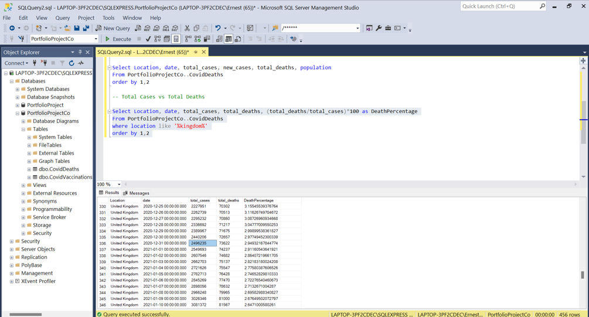
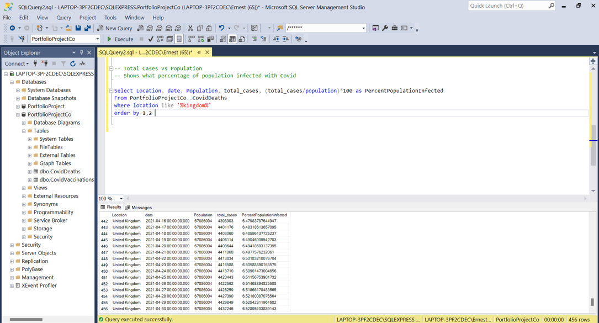
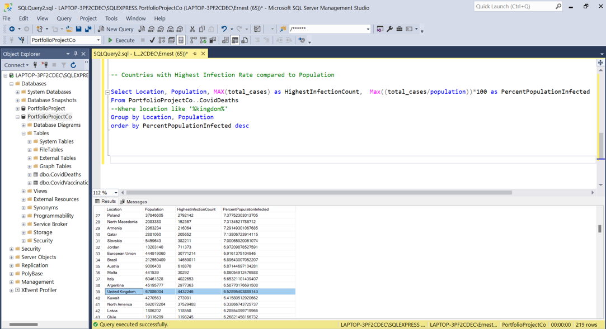
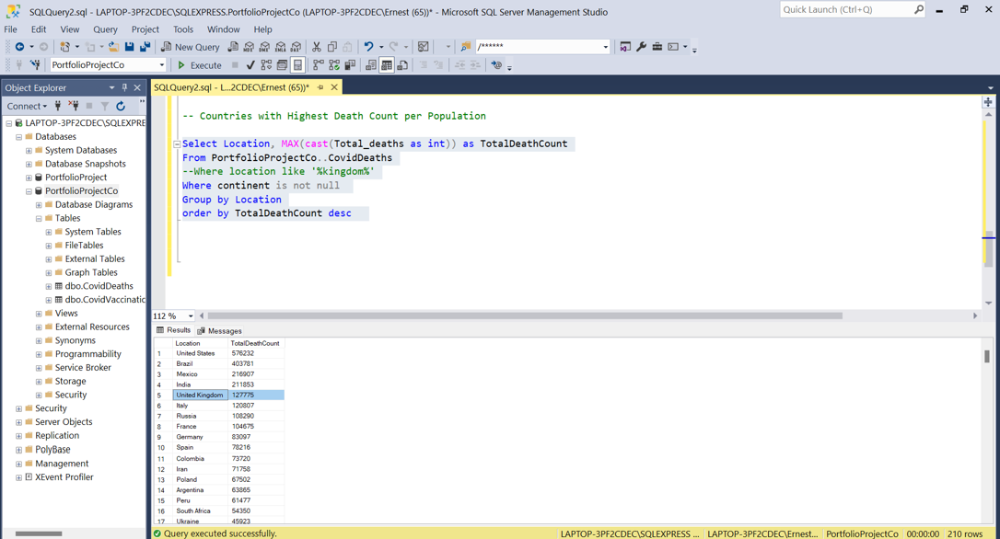
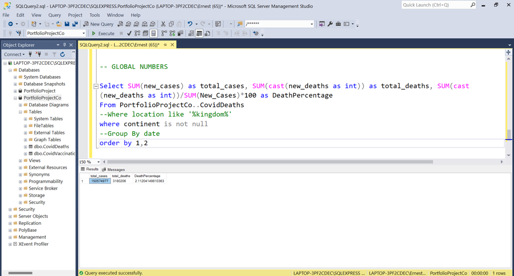
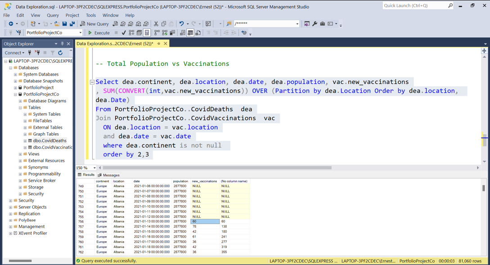
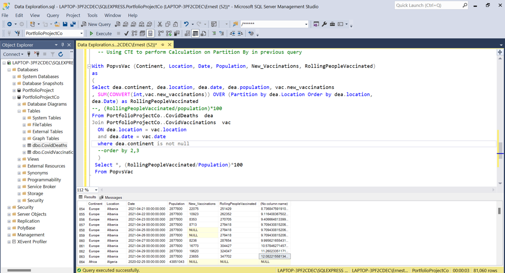
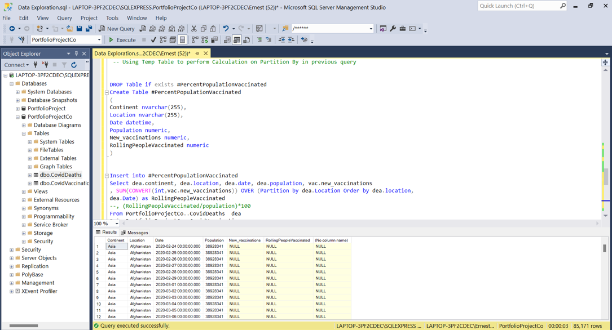

# SQLDataExploration
## COVID: SQL Data Exploration
COVID-19 world wide data between 2020-2021 Including cases, deaths and vaccination information. 

 
At the date of 31/12/20 in the United Kingdom 2,496235 people infected and 73622 total deaths. 

 
In the United Kingdom date of 30/4/21 6.5% of the population has gotten a test and these were positive results.

 
The UK inside of the top 40 countries with the highest infection rate place at 39. 4432246 is the HighestInfectionCount which is the max total cases in the United Kingdom with 6.5% PercentPopulationInfected.

 
The United Kingdom is ranked 5 with the highest death count of 127775. 

 
Continent showing total death count in descending order.

 
Total cases 150,574,977 million vs 3,180,206 million overall across the globe we are seeing a death percentage of just over 2%.

 
The first new vaccinations in Albania started around 13/1/2021 the first is 60 we get 60 then we add 78. 78 + 60 we get 138. It adds up every single consecutive one. When there is nulls or zeros it’s going to not add anything.

 
12% of the population in Albania is vaccinated. We (RollingPeopleVaccinated/Population)*100 to calculate the percentage, this increases per day. 

 
Using Temp table to perform calculation on partition by in previous query.

Created a view so that it can be used to store data for visualizations.

